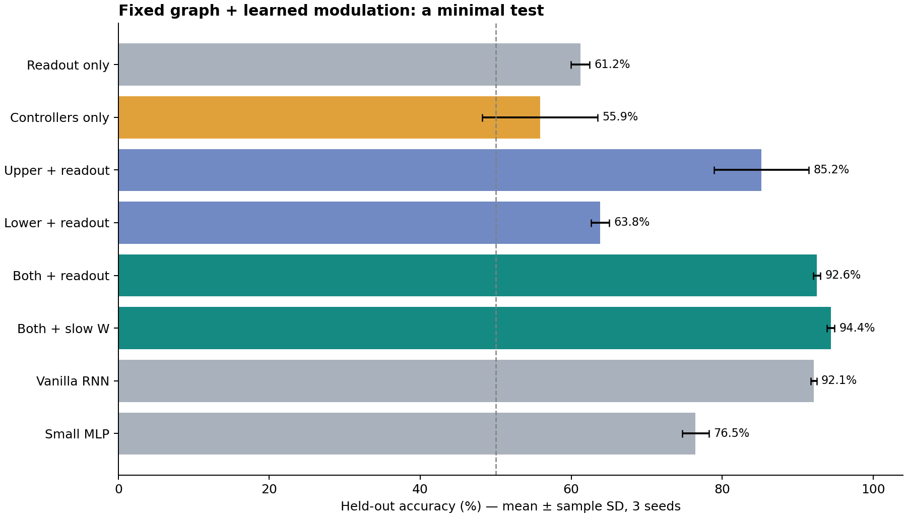
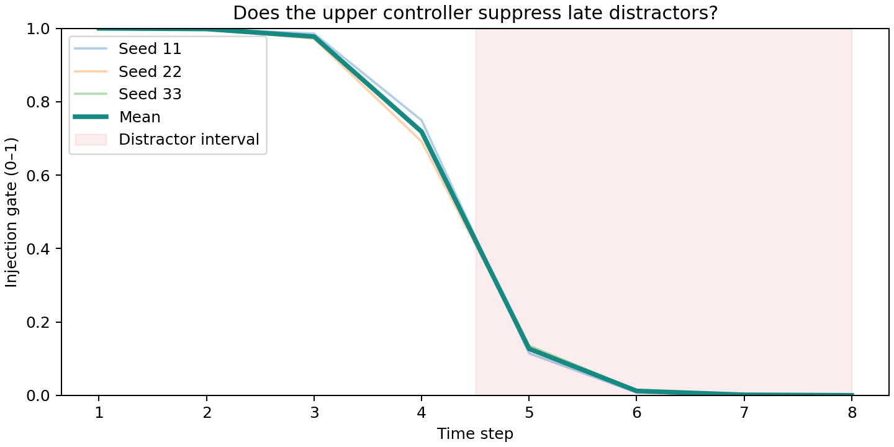

# 最小模型实测报告

日期：2026-09-25。结果来自本目录代码的真实 CPU 运行。

## 结论

**支持底层冻结时，学习双层调制器＋输出层完成这个合成任务；不支持当前设置下连随机输出层也冻结、仅靠控制器就能稳定完成任务。**

固定底层的主模型平均准确率 92.55%，普通 RNN 为 92.14%。差异不足以据此宣布主模型更好。主模型可训练参数较少，但训练更慢：平均 5.19 秒，对照 RNN 为 2.12 秒。训练参数少不等于计算量小。

严格只训练控制器为 55.87% ± 7.66 个百分点，接近随机猜测且不稳定。这并不证明所有“只训练控制器”架构都不可行：这里只测了一个随机编码器、随机读出、64 节点和特定门控表达能力的组合。

## 设计与结果

输入四路 8 步随机信号，指令选择一路，输出这一路前四步之和的正负。后四步为干扰。标签大致均衡，随机猜测约 50%。64 节点、四块、20% 固定随机连接。

每个随机种子 2048 个训练样本、512 个验证样本、4096 个独立测试样本；种子 11、22、33。所有模型 100 epoch、相同批次顺序，按验证集选最佳 checkpoint。标准差为三次试验间样本标准差，不是置信区间。

| 模型 | 测试准确率（均值±样本标准差） | 可训练参数 | 每次训练秒数 |
|---|---:|---:|---:|
| 固定网络，仅训练输出层 | 61.21% ± 1.25 个百分点 | 65 | 2.08 |
| 严格仅训练两个控制器 | 55.87% ± 7.66 个百分点 | 376 | 5.50 |
| 仅上层＋输出层 | 85.21% ± 6.27 个百分点 | 229 | 3.68 |
| 仅下层＋输出层 | 63.83% ± 1.20 个百分点 | 277 | 4.17 |
| 两个控制器＋输出层，底层冻结 | 92.55% ± 0.49 个百分点 | 441 | 5.19 |
| 两个控制器＋输出层＋底层慢速微调 | 94.41% ± 0.50 个百分点 | 4537 | 5.72 |
| 普通 RNN 全量训练 | 92.14% ± 0.38 个百分点 | 4801 | 2.12 |
| 小型 MLP 全量训练 | 76.49% ± 1.75 个百分点 | 571 | 0.48 |

## 调制器学到了什么

主模型在目标通道前四步的平均注入强度为 **0.923**，后四步降到 **0.035**，说明它在本任务中学会保留早期信息、压低晚期干扰。

对训练完成的主模型强制取消上层过滤（所有注入门全开），准确率平均降到 **57.01%**；强制下层通路全开，准确率降到 **90.04%**。这表明预测依赖注入控制，下层也有一定贡献。单独重新训练上层＋输出层是 **85.21%**，单独下层＋输出层是 **63.83%**；两类证据一起支持本配置下组合调制的作用。

这些干预会改变中间激活分布，不能把下降幅度直接等同于各组件独立的因果贡献；样本数和种子数也有限。

底层慢速微调是 **94.41%**，比冻结底层高 **1.86 个百分点**。学习率小不等于参数变化必然很小；每轮最大变化保存在 metrics.json 中。本实验拓扑始终固定。

## 已实际完成的核验

- 24 个保存的 checkpoint 全部重新加载，复算测试准确率，与 metrics.json 逐项完全相同。
- 固定网络组的 W、B、C 和拓扑掩码与初始化逐元素一致。
- 严格控制器组的输出权重、偏置也与初始化逐元素一致。
- predict.py 对同一段信号分别给四种查询，示例预测四项均正确；它只是运行演示，统计证据来自独立测试集。
- CPU，Python 3.12.14、PyTorch 2.14.0+cpu、NumPy 2.3.5、Matplotlib 3.10.8；两线程。累计记录的训练时间约 86.81 秒，不含安装、绘图、存储和核验。

## 哪些还没有验证

这不是完整实现聊天中的全部设想。未训练文本/图像编码器；没有脉冲相位、可变频率和停止次数；没有离散带宽预算、量化信道或延迟优化；没有真实稀疏内核、显存或能耗比较。软门控变小不代表信道容量提高。

任务有明显的通道选择和干扰过滤结构，对上层门控有利。尚无真实数据、未见任务、分布外、长序列证据；也未和 Transformer 做公平对照。因此不能据此证明智能涌现、提出新架构，或声称优于大模型。

## 下一步最有信息量的实验

1. 保持三种子及独立测试，将干扰时段随机化并向模型提供明确的有效信号标记，检验是否只背下“前四步有效”。
2. 增加严格离散的每步 top-k 通道预算、量化位数，对比固定/随机路由，报告准确率与真实发送标量数。
3. 使用不同任务/更长序列与参数、计算预算接近的 RNN/GRU 对照；若严格只训练控制器仍不稳定，再分别检验预训练编码器或预训练读出的作用。

这些属于后续研究建议，本包未声称已完成。
