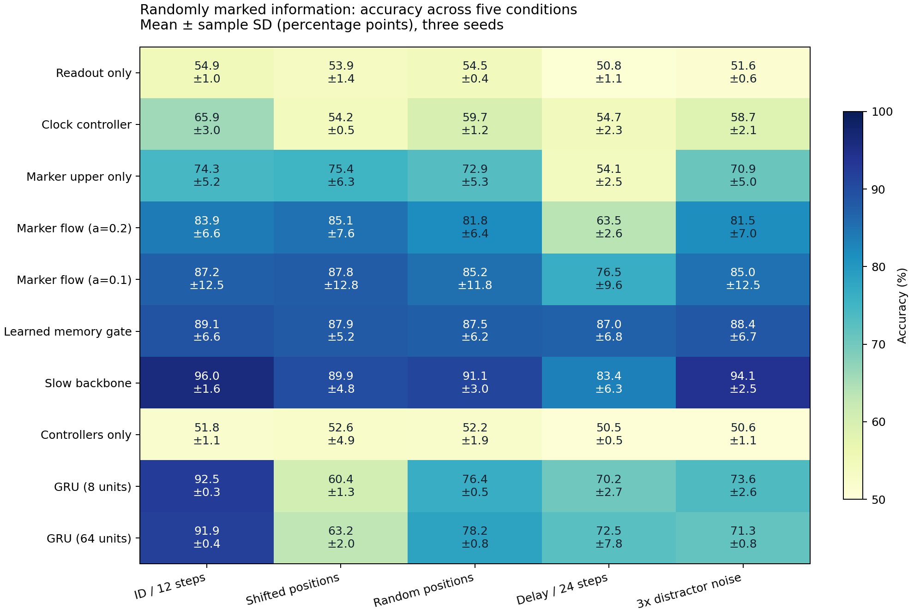
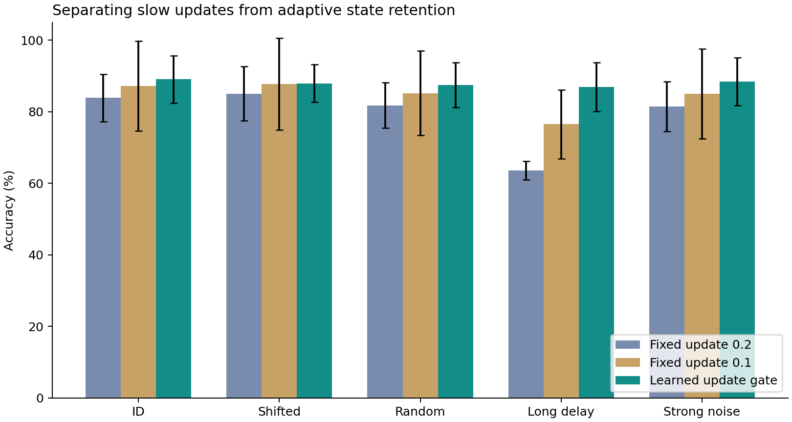

# 第二轮实测报告：选择信息之后，还需要保住状态

2026-09-25。10种模型设置×3个随机种子＝30次训练；每个模型测试5种独立分布。以下数值来自实际训练并保存的模型。

## 核心结论

1. **上层能利用外部有效标记选择随机出现的信息，已超出固定时段开关。** 原标记调制模型在常规测试83.85%、未见有效位置85.06%；上层只能看任务与时间的对照分别65.87%、54.16%。有效标记来自外部，不代表自主识别无标记信息的重要性。
2. **信息筛选和状态保持是两个不同问题。** 原标记调制模型在干扰延长后降到63.54%；增加7个参数的保持门后为86.98%。固定慢更新对照为76.50%，提示不只是整体更新变慢，但种子较少、波动较大，未做显著性检验。
3. **可靠性尚未解决。** 保持门模型常规测试89.08% ± 6.63个百分点，低于小GRU的92.50% ± 0.31个百分点；两个种子出现单个任务通道近乎被关闭的现象。
4. **不能据此证明复杂下层路由必不可少。** 保持门模型训练后强制下层全开，常规准确率仍有88.66%，长干扰86.52%，与原值89.08%/86.98%很接近。当前证据更突出上层选择与状态保持的作用；需重新训练“无下层＋保持门”来判断能否简化网络。

## 任务和控制变量

四路12步独立高斯信号，指令指定一路，每例有两个随机有效时刻，标签为该通道两个有效值之和的正负。训练有效位置随机在前六步；标记、信号值和任务独立生成。所有模型获得相同的信号、任务、时间和标记。已知任务规则直接求和可100%正确，用于检查标签，不作为神经网络基线。

每种子训练3072、验证768，每测试条件4096样本；种子11/22/33。100轮、batch256、Adam 0.003，底层微调学习率0.00015。只由常规验证集选checkpoint，测试不用于训练或选轮次。所有Flow64节点、四块、同一稀疏初始化。没有根据测试成绩补训练或更换超参数。

固定慢更新对照在主实验进行期间、未查看保持门结果前确定，单独存于results_slowleak。主实验与其CPU运行时段部分重叠，因此不以本次运行时间比较效率。

## 全部结果

单位为准确率百分数，±为三随机种子的样本标准差（百分点），不是置信区间。

| 模型 | 常规 | 未见位置 | 全段随机位置 | 长干扰 | 强干扰 | 可训练参数 |
|---|---:|---:|---:|---:|---:|---:|
| 只训练读出 | 54.90 ± 0.95 | 53.88 ± 1.45 | 54.52 ± 0.39 | 50.82 ± 1.10 | 51.55 ± 0.57 | 65 |
| 上层只看时钟/任务 | 65.87 ± 2.99 | 54.16 ± 0.52 | 59.69 ± 1.23 | 54.65 ± 2.27 | 58.68 ± 2.08 | 457 |
| 标记上层＋读出 | 74.34 ± 5.21 | 75.36 ± 6.27 | 72.89 ± 5.34 | 54.08 ± 2.53 | 70.87 ± 5.01 | 245 |
| 标记上下层＋读出，固定更新0.2 | 83.85 ± 6.58 | 85.06 ± 7.62 | 81.80 ± 6.40 | 63.54 ± 2.59 | 81.48 ± 7.00 | 457 |
| 固定慢更新0.1 | 87.19 ± 12.52 | 87.76 ± 12.84 | 85.20 ± 11.84 | 76.50 ± 9.62 | 85.01 ± 12.50 | 457 |
| 加入可学习保持门 | 89.08 ± 6.63 | 87.93 ± 5.24 | 87.48 ± 6.24 | 86.98 ± 6.81 | 88.43 ± 6.70 | 464 |
| 底层慢速微调（无保持门） | 96.00 ± 1.64 | 89.89 ± 4.76 | 91.06 ± 3.00 | 83.37 ± 6.33 | 94.07 ± 2.52 | 4553 |
| 严格只训练控制器 | 51.83 ± 1.06 | 52.63 ± 4.92 | 52.24 ± 1.95 | 50.48 ± 0.53 | 50.58 ± 1.07 | 392 |
| GRU 8单元 | 92.50 ± 0.31 | 60.45 ± 1.34 | 76.43 ± 0.49 | 70.22 ± 2.72 | 73.55 ± 2.59 | 489 |
| GRU 64单元 | 91.91 ± 0.41 | 63.18 ± 2.03 | 78.20 ± 0.80 | 72.53 ± 7.82 | 71.30 ± 0.84 | 14657 |

未见位置：有效标记只出现在后六步，训练未见。它们离最终输出更近，因此不比原分布在所有方面都难。全段随机位置：两个有效时刻在12步任意位置。长干扰：总长24，有效时刻仍在前六步。强干扰：无效信号标准差增到3，有效信号不变。

长干扰条件同时改变了归一化时间输入的数值，是组合分布外测试；不能把下降完全归于单一记忆长度因素。各条件独立取样，不是同一批信号的逐样本配对变换。

## 保持门究竟做了什么

基础更新为h_next=(1-a)*h+a*candidate，原模型a恒为0.2。保持门a=0.2*sigmoid(Linear([任务,时间,标记]))，新增7个参数。没有直接把标记硬编码成更新开关。

保持门模型学到：有效时刻平均a=**0.1708**，无效时刻平均a=**0.0200**。即有效时刻多写入，干扰时刻少改动已有状态。

目标通道的平均注入强度：有效时刻**0.8183**，无效时刻**0.0258**。该均值包含失败通道，不能解释为每个任务都正常工作。

对同一个已训练模型强制将a固定回0.2，常规准确率降至**69.65%**，长干扰降至**53.59%**。这种干预改变了模型内部工作分布，不能单独证明因果贡献；结合重新训练的固定0.1对照，才形成较完整的机制证据。

固定0.1的三个种子常规结果94.58%、94.26%、72.73%，本身也不稳定。长干扰条件下保持门在三个配对种子上均高于固定0.1，但这仍只是三个初始化，不能宣称普遍优势。

## 发现的具体失败模式

保持门模型种子22：

| 任务通道 | 测试准确率 | 有效时刻注入强度 |
|---|---:|---:|
| 0 | 51.39% | 0.000548 |
| 1 | 95.77% | 0.995579 |
| 2 | 95.39% | 0.996624 |
| 3 | 97.08% | 0.996814 |

种子33的通道2也类似：准确率52.24%，注入强度约0.000072；其他三个通道都在97%以上。种子11四个通道都在95%以上。

直接观察是：失败通道几乎被关闭，同时其预测接近猜测。这与“关闭后缺少有效梯度、难以重新打开”的解释相符，但本轮没有保存逐训练步的门控与梯度轨迹，**尚不能确认关闭形成的因果过程，也不能断定随机底层缺少表示能力**。诊断是测试后的解释性分析，没有据此改模型或重新挑checkpoint。

## 与GRU的比较应怎样理解

小GRU常规测试更稳定、平均准确率更高，但未见位置只有60.45%，长干扰70.22%，强干扰73.55%。保持门模型这三项为87.93%、86.98%、88.43%。这些结果支持特定结构在本任务上的泛化偏置，不支持“普遍优于GRU”。

大GRU本次设置也没有更好；未对其做充分学习率、正则化、模型宽度或训练分布搜索。比较的是这套相同训练轮次下的配置，不是各架构最优性能。所有Flow有额外冻结权重，不能把可训练参数接近称为总存储或计算公平匹配。

## 底层冻结与慢速微调

严格仅训练控制器、读出也冻结，常规51.83%、长干扰50.48%，再次未能稳定完成任务。

允许W以1/20学习率微调，常规96.00%、长干扰83.37%，表现较好。但这组未包含保持门，因此不能解释成“慢速微调＋保持门”的已验证结果。学习率小不保证权重最终变化很小，原始最大变化在metrics.json中。

## 验证与边界

verify.py重新生成任务，以不同表达式核验标签、标记数量/范围；检查控制器有梯度、冻结W没有梯度。重新加载30个检查点，复算150项测试准确率，并检查冻结权重。具体执行结果保存于verification.txt、verification_slowleak.txt。

第一轮与第二轮任务、输入和样本数不同，不直接比较两轮准确率。本轮仍未验证真实数据、无标记的重要性识别、语言推理、动态带宽、脉冲相位或真实稀疏加速。状态有界不等于长期信息保真。

## 下一步应该验证什么

优先处理已暴露的通道关闭问题，而非立即放大网络：记录分通道门控/梯度随训练变化，对比早期保持通路开放、门控最小值或先训练读出的方案；这些目前只是待验证假设。

同时重新训练“上层＋保持门、下层恒开”的简化模型，检查复杂通路调制是否必要。若能保留性能，更简单的结构更值得继续。之后再做严格top-k传输预算及无标记真实数据任务。
