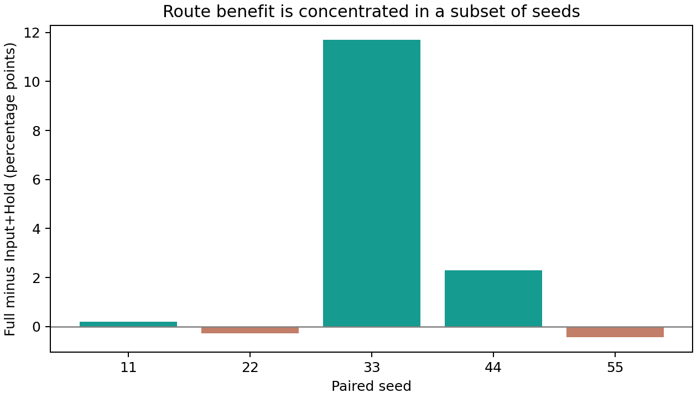
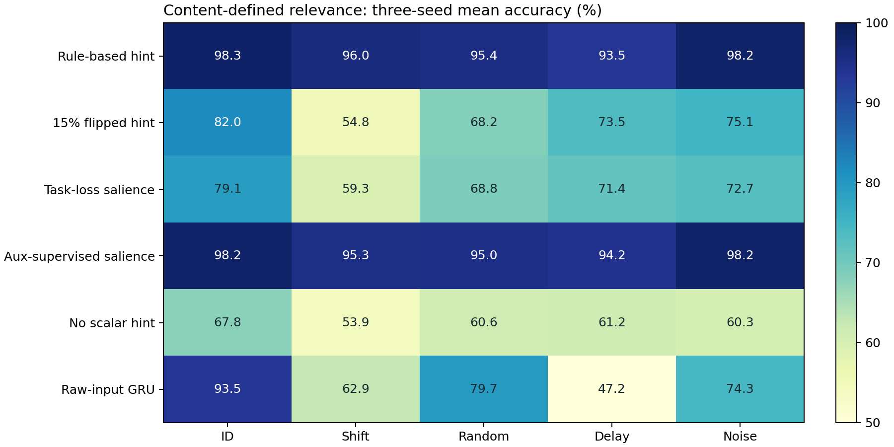
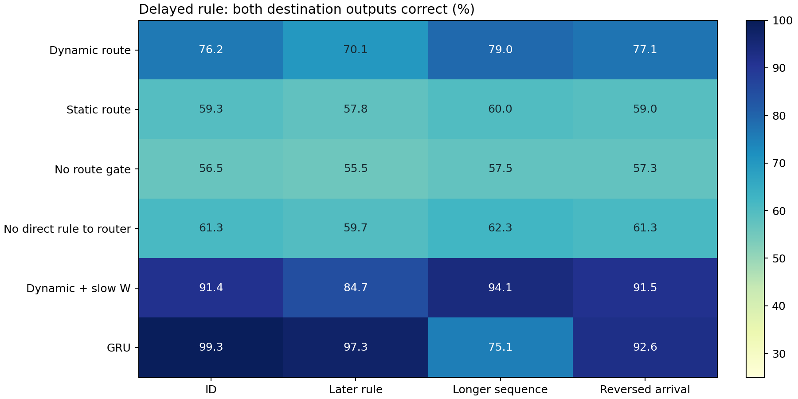
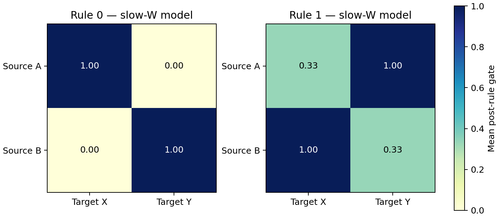

# 第四轮实测报告：Salience、条件路由与旧模型结构审计

2026-09-25。实际执行旧5个模型审计，另做36次新训练：Salience六组×三种子，延迟规则六组×三种子。所有预设结果，包括失败，均保留。

## 本轮最重要的结果

1. 旧任务的动态门平均准确率87.53%，替换成全局固定门后87.37%；任务相关门图并不足以证明动态变化有功能贡献。
2. 仅最终任务损失训练Salience，常规79.11%、未见位置59.28%；有明确匹配辅助监督为98.23%和95.27%。当前证据支持“有监督可学”，尚未支持“端到端稳定自主发现”。
3. 新条件任务中，动态路由常规双输出全对76.22%，静态路由59.29%；加慢速W为91.41%。这次动态路由确有更明确的当前架构内收益。
4. GRU常规双输出全对99.35%，仍高于动态慢速W；长序列为75.15%，低于后者94.08%。准确率与泛化取舍仍存在，不是全面领先。
5. 五张旧图都完全强连通；拓扑与收益的关系仍混有初始化、数据和优化因素，没有证实“好拓扑导致Router有用”的因果结论。

## 1. 用户新意见中的两点需要校正

上一轮约86%是15%标记翻转条件的理想分布参考，不是模型实测成绩。随机seed还同时改变图、权重、读出和数据；尚不能把seed差异称为显著拓扑因果效应。

此外，“R到来后交换A/B”不能在逻辑上证明显式Route Gate不可替代。GRU、保持门或一般状态动力学也可能实现同样计算。本轮采用局部目的读出与公平可观察输入，直接比较真实差异。

## 2. 旧五个种子：Route收益很不均匀

| 种子 | Full − IH，百分点 |
|---|---:|
| 11 | +0.20 |
| 22 | -0.27 |
| 33 | +11.69 |
| 44 | +2.29 |
| 55 | -0.44 |

平均收益2.70个百分点，中位数0.20个百分点。更大的均值主要由部分种子贡献；其余测试和Full对IR/RH的配对差值见prior_paired.json。

## 3. 拓扑指标没有直接证实“可路由性”解释

五张图都完全强连通，可达对比例与最大强连通分量比例均为1。平均最短路范围1.842–1.883；有效秩49.73–51.15；谱半径0.455–0.523。谱范数被初始化固定在约0.9，其数值舍入差异不作相关。

完整指标和Pearson/Spearman系数已保存。只有5个样本且存在混杂、重复指标与多重比较，相关值即使大也不能据此宣布哪类拓扑最好。无权短路径也未反映带符号权重的抵消、读出可解码性和训练局部最优。

下一步若专门追“什么网更适合Route”，必须固定数据、编码/读出和控制器初始化，仅改变拓扑；再分别交叉改变权重种子与拓扑种子。目前没有完成这项因果隔离训练。

## 4. 门随任务变化，不等于变化对任务有用

旧模型的同输入不同查询配对门控距离平均0.493（0–1尺度），确有任务相关变化。但是ID测试：

| 旧模型推理方式 | 五种子平均准确率 |
|---|---:|
| 原动态门 | 87.53% |
| 替换为训练集校准的全局固定门 | 87.37% |
| 替换为按查询固定的门 | 87.54% |

所以旧任务上Router虽表现出动态模式，ID答案对这类变化并不敏感。可能主要是训练期间的共同适应或固定有效变换发挥作用，但当前干预不能确认形成原因；也未把该结论推广到旧任务所有OOD条件。

门控熵是每个软门对应Bernoulli熵，不能单独当作动态性：固定0.5的门也有高熵。活动边比例按阈值0.1/0.5/0.9和实际边数加权，所有计算仍为稠密实现，不等于节省同样比例FLOPs。

## 5. Salience：从可观察内容判断匹配

新任务每事件有值和键，查询指定键。有效性由键是否匹配查询确定，两个匹配值之和的符号为标签。不再删除不可推断的随机位置标记。所有模型都获得原始值、键、查询、时间；完美提示组只额外使用硬编码匹配规则。新任务已知规则可100%求解，不受上一轮无标记约70%的信息上限限制。

全部Flow使用相同64节点初始化、Write/Route/Hold和读出，W慢速微调；仅改变相关性标量来源。GRU直接看原始字段。单位为准确率%，±为三种子样本标准差。

| Salience设置 | 常规 | 未见位置 | 任意位置 | 长干扰 | 强干扰 |
|---|---:|---:|---:|---:|---:|
| 规则直接给提示 | 98.25 ± 0.31 | 96.01 ± 0.98 | 95.43 ± 0.98 | 93.47 ± 2.19 | 98.17 ± 0.21 |
| 15%翻转提示 | 82.01 ± 0.28 | 54.84 ± 0.49 | 68.23 ± 0.88 | 73.49 ± 1.02 | 75.10 ± 0.68 |
| 仅任务损失学习 | 79.11 ± 0.36 | 59.28 ± 2.77 | 68.82 ± 0.94 | 71.37 ± 1.81 | 72.66 ± 0.61 |
| 额外匹配监督 | 98.23 ± 0.36 | 95.27 ± 1.05 | 95.04 ± 1.14 | 94.24 ± 1.02 | 98.17 ± 0.34 |
| 无显式相关性标量 | 67.82 ± 1.10 | 53.91 ± 4.32 | 60.60 ± 2.06 | 61.17 ± 1.85 | 60.33 ± 2.13 |
| 原始输入GRU | 93.51 ± 0.82 | 62.87 ± 2.61 | 79.68 ± 0.93 | 47.25 ± 7.97 | 74.30 ± 1.92 |

监督辅助组额外使用匹配标签及0.2权重BCE，必须与“只用最终答案损失”的learned组区分。它验证编码器能学会匹配规则，不证明无需相关性监督即可稳定发现重要性。none组没有显式标量，但仍保留原始键/查询，所以不是信息缺失对照。

相关性MLP不看信号值，无法直接计算答案；但底层也有键/查询输入路径，因此准确率不能全部归功于Salience标量。标量置零干预与各检查点分数矩阵均在salience/metrics.json。

端到端标量可能按查询采用不同方向编码。为避免全局AUC误导，补充逐查询AUC：

| 种子/编码训练 | 全局原始AUC | 逐查询原始AUC | 逐查询无方向AUC均值 |
|---|---:|---|---:|
| 11/learned | 0.500 | 0.667, 0.000, 1.000, 0.333 | 0.833 |
| 11/supervised | 1.000 | 1.000, 1.000, 1.000, 1.000 | 1.000 |
| 22/learned | 0.500 | 0.667, 1.000, 0.000, 0.333 | 0.833 |
| 22/supervised | 1.000 | 1.000, 1.000, 1.000, 1.000 | 1.000 |
| 33/learned | 0.521 | 0.333, 0.333, 1.000, 0.667 | 0.750 |
| 33/supervised | 1.000 | 1.000, 1.000, 1.000, 1.000 | 1.000 |

无方向AUC是事后诊断max(AUC,1−AUC)，不是预测时额外使用标签修正分数，也不能把它称为已校准的重要性概率。

## 6. 延迟规则：检验数据要去哪里

先输入A/B，之后才给规则R，要求目的X/Y分别回答A/B的符号或交换后的符号。两个读出只能看到各自目的模块；原始值只注入来源模块。按源块×目标块门控制实际允许的边，不再用旧架构仅4个源门来假装能独立控制所有目的地。

所有Flow的Write/Hold都能看到相同已到达规则，所以没有剥夺对照输入。rule_blind只是Router不直接看规则值，状态仍可能间接携带规则。动态、静态、无Router均从头训练；dynamic_slow另允许底层以1/20学习率适应。

主指标为两个输出同时正确。A/B同号时交换不改变标签，因此另报异号子集，避免容易样本掩盖条件处理失败。

| 路由设置 | 常规全对 | 异号子集全对 | 更晚规则 | 长序列 | 输入顺序反转 |
|---|---:|---:|---:|---:|---:|
| 动态路由 | 76.22 ± 14.22 | 53.60 ± 27.40 | 70.10 ± 8.59 | 79.04 ± 15.79 | 77.14 ± 13.20 |
| 静态可训练路由 | 59.29 ± 2.87 | 19.46 ± 5.53 | 57.80 ± 2.07 | 59.99 ± 2.51 | 59.03 ± 2.27 |
| 通路全开 | 56.54 ± 5.14 | 15.77 ± 10.24 | 55.54 ± 3.97 | 57.51 ± 4.59 | 57.34 ± 3.67 |
| Router不直接看规则 | 61.30 ± 4.46 | 23.60 ± 9.91 | 59.70 ± 4.05 | 62.33 ± 4.35 | 61.30 ± 5.40 |
| 动态路由＋慢速W | 91.41 ± 8.61 | 82.97 ± 17.00 | 84.67 ± 10.24 | 94.08 ± 6.77 | 91.46 ± 7.97 |
| GRU | 99.35 ± 0.11 | 99.15 ± 0.46 | 97.31 ± 0.51 | 75.15 ± 0.93 | 92.59 ± 2.20 |

这张表只比较本轮这些配置，不证明某架构普遍优越。若GRU也能解题，它直接说明显式Router并非逻辑必需；若动态模型优于静态对照，才支持其在当前模块结构里的增益。冻结W和慢速W要分开判断。

## 7. 新任务的Route Utilization

| 路由类型 | 按边加权门熵，bits | 两规则配对门距离 | 静态均值干预后全对率 |
|---|---:|---:|---:|
| dynamic | 0.087 | 0.337 | 61.90% |
| static | 0.578 | 0.000 | 59.29% |
| none | 0.000 | 0.000 | 56.54% |
| rule_blind | 0.023 | 0.000 | 61.30% |
| dynamic_slow | 0.135 | 0.414 | 52.67% |

矩阵是dynamic_slow三个种子的平均，使用相同A/B分别设置两种规则。理想交换会改变A/B至X/Y通道的相对开放程度，但学习结果不必呈二值开关。只对结构存在的边统计熵和距离。

静态均值来自训练校准集，是对已有模型的推理干预，会引入分布变化。需与静态Router的独立重训结果一起看。反事实测试验证规则到来前状态逐元素一致，避免未来规则泄漏；异号子集的“两种规则均正确率”也保存在原始指标中。

## 8. 复现和边界

两新任务均三种子11/22/33，训练3072、验证768、每测试4096、100轮、batch256。只按各自ID验证集选checkpoint。新Salience的Flow均慢速W；条件任务仅dynamic_slow微调W。未按测试调参或排除失败种子，未匹配所有组总参数与计算量。

verify.py重新加载36个新检查点，复算90项Salience和216项路由准确率；检查固定张量、Salience不读取外部hint、任务标签、后到规则的前缀状态一致和局部读出。具体执行结果见verification.txt。

旧图相关性是审计，没有因果隔离。新两任务与旧任务结构和输入不同，不能直接比较跨轮准确率。未验证自然数据上的重要性、真实带宽、真实稀疏计算或规模涌现。

后续优先：把拓扑、权重初始化、数据种子分开控制；对learned Salience的局部最优设计固定的训练策略对照；再在确实需要组合计算的任务上比较动态路由与等预算基线。不能仅因门控热图好看就宣称发现了智能路由。
