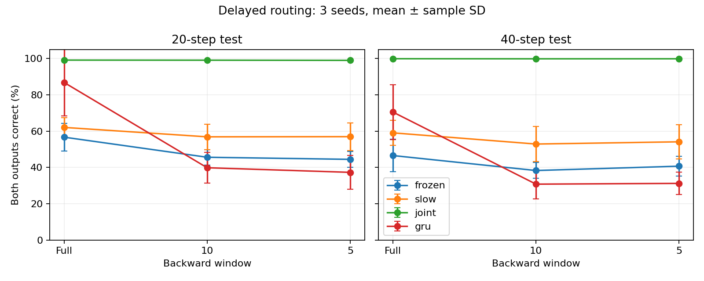

# 第五轮：梯度窗口实测报告

基于另一对话的新意见，完成36次配对训练。20步序列，规则第4步起可见；初两步写入A/B，最终输出。完整/10步/5步反传，三种子。以下为两个输出同时正确率，均值±样本标准差。

| 模型 | 反传窗口 | 常规20步 | 测试40步 |
|---|---|---|---|
| frozen | 完整 | 56.67 ± 7.54% | 46.55 ± 8.95% |
| frozen | 10 | 45.61 ± 4.20% | 38.30 ± 4.33% |
| frozen | 5 | 44.45 ± 4.34% | 40.69 ± 5.32% |
| slow | 完整 | 62.04 ± 5.26% | 59.05 ± 6.92% |
| slow | 10 | 56.85 ± 7.01% | 52.88 ± 9.62% |
| slow | 5 | 56.93 ± 7.67% | 54.12 ± 9.47% |
| joint | 完整 | 99.10 ± 0.14% | 99.87 ± 0.12% |
| joint | 10 | 99.06 ± 0.10% | 99.82 ± 0.14% |
| joint | 5 | 98.97 ± 0.20% | 99.84 ± 0.16% |
| gru | 完整 | 86.80 ± 18.40% | 70.49 ± 15.07% |
| gru | 10 | 39.83 ± 8.56% | 30.79 ± 8.18% |
| gru | 5 | 37.29 ± 9.22% | 31.22 ± 6.23% |

## 解释范围

完整反传初两步输入梯度均非零，截断后为零；训练前向与不截断前向数值一致。说明截断切断的是梯度路径，不是清除记忆状态。冻结W仍允许损失通过W传回控制器，不能理解为无法反向传播。

截断采用仅末端损失，没有中间辅助任务或局部塑性。窗口短于事件—答案间隔后，早期写入缺少直接梯度监督；共享控制器仍可从后期时间步更新。本结果不能单独代表所有截断BPTT、Hebbian或持续学习算法。

数据量1024/512/2048、60轮；各配对组数据、种子、批次顺序相同，仅ID验证选模型。参数与计算量未匹配。只有20步与40步，未完成建议的200步基准，也未开始A→B→C遗忘实验。不可直接对比第四轮不同预算的分数。

## 验证

36个检查点重载，72组测试指标逐项一致；前向截断一致性通过，训练时固定B/mask/W检查通过。原始逐种子成绩、验证曲线、配置和模型均保留。

运行：`python run.py`，随后 `python finish.py`。需要PyTorch和NumPy。
## 本轮结论与下一步

1. 能反向传播且能训练：正常学习率W三种子完整反传99.10%，5步窗口98.97%，支持当前结构在短梯度窗口下仍能学习。
2. 不支持冻结/慢速底层已足够：完整梯度冻结56.67%、慢速62.04%，正常W99.10%。仅能判断当前预算与学习率，不能宣布慢速长期学习无效。
3. GRU完整86.80±18.40%，5步37.29±9.22%；种子方差和训练预算限制明显。不是对GRU普遍能力的否定。
4. 短梯度窗口≠短前向记忆，持续可见规则与共享参数可能帮助后期梯度改进整段动力学。尚未定位具体因果机制。
5. 下一阶段按原建议做A→B→C→D持续学习：使用可观察任务身份与无矛盾标签，固定评估集，每阶段重测所有任务；比较冻结/慢W/全W/GRU，记录完整任务×阶段矩阵及遗忘、适应速度。先保证单任务可学，避免把本就没有学会误称为不遗忘。随后再扩到200步梯度窗口基准。

