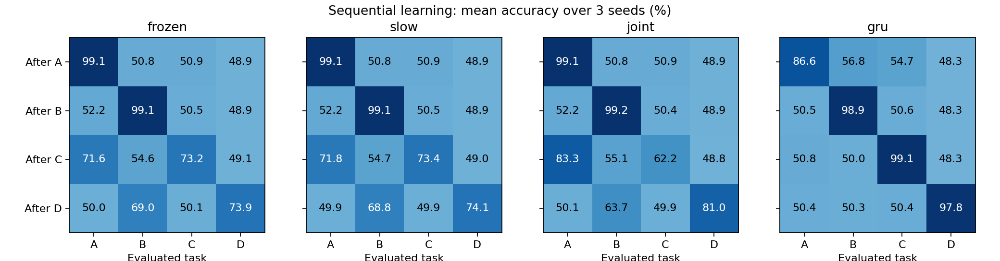

# 第六轮：顺序持续学习实测

检索到的另一对话建议是顺序学习并测遗忘；未取得对第五轮成绩的新回复。本轮完成12条连续训练流（36个适应阶段）及9个独立适应对照。每阶段60轮、三种子。A为第五轮预训练任务，此后B→C→D无回放。新增任务身份明确可见。

| 设置 | 初始A | 刚学完B/C/D平均 | 最终四任务平均 | 旧任务遗忘 |
|---|---|---|---|---|
| frozen | 99.07 ± 0.32% | 82.08 ± 1.14% | 60.76 ± 3.06% | 34.09 ± 4.57% |
| slow | 99.07 ± 0.32% | 82.22 ± 1.05% | 60.64 ± 3.27% | 34.39 ± 4.82% |
| joint | 99.07 ± 0.32% | 80.79 ± 7.13% | 61.16 ± 2.43% | 32.26 ± 5.84% |
| gru | 86.56 ± 17.83% | 98.61 ± 0.45% | 62.22 ± 0.82% | 44.49 ± 6.05% |

遗忘按A/B/C已学阶段最好测试分减最终分，再平均；单位为百分点（表中百分号仅表示数值尺度）。小遗忘必须结合新任务学会程度判断。

## 平均任务×阶段矩阵

### frozen

| 阶段结束 | A | B | C | D |
|---|---|---|---|---|
| 预训练A | 99.07 | 50.80 | 50.94 | 48.91 |
| 学完B | 52.25 | 99.09 | 50.49 | 48.91 |
| 学完C | 71.65 | 54.64 | 73.23 | 49.09 |
| 学完D | 49.97 | 69.03 | 50.13 | 73.93 |

### slow

| 阶段结束 | A | B | C | D |
|---|---|---|---|---|
| 预训练A | 99.07 | 50.80 | 50.94 | 48.91 |
| 学完B | 52.23 | 99.14 | 50.49 | 48.91 |
| 学完C | 71.79 | 54.69 | 73.44 | 48.96 |
| 学完D | 49.87 | 68.75 | 49.87 | 74.07 |

### joint

| 阶段结束 | A | B | C | D |
|---|---|---|---|---|
| 预训练A | 99.07 | 50.80 | 50.94 | 48.91 |
| 学完B | 52.21 | 99.15 | 50.41 | 48.91 |
| 学完C | 83.35 | 55.09 | 62.21 | 48.80 |
| 学完D | 50.11 | 63.66 | 49.87 | 81.01 |

### gru

| 阶段结束 | A | B | C | D |
|---|---|---|---|---|
| 预训练A | 86.56 | 56.77 | 54.72 | 48.29 |
| 学完B | 50.54 | 98.89 | 50.55 | 48.26 |
| 学完C | 50.83 | 50.02 | 99.12 | 48.27 |
| 学完D | 50.41 | 50.28 | 50.41 | 97.80 |

## 独立适应控制

每个任务从相同预训练Flow起点独立正常更新W，未先学习中间任务。
- B：99.15 ± 0.07%
- C：99.02 ± 0.43%
- D：73.16 ± 1.59%

## 边界与复现

Flow三个学习率分支共享预训练权重，额外任务输入权重零初始化，已验证扩展前后初始前向一致。GRU预训练能力不同，不能据此做完全公平的架构优劣排名。任务是相互关联的合成路由规则，身份明确可见，只有一个顺序。冻结W时控制器与读出仍可训练。本轮没有回放、参数保护、局部塑性或任务专属读出。

所有阶段固定训练60轮，最后状态继续学习，验证只记录而不选模型；旧测试集不参与训练。保存逐轮曲线，可查达90%验证分的适应速度（未达到记为未达到）。只有3个种子，全部结果保留。

验证：45个阶段/控制检查点重载，180个任务测试分逐项相同；前向扩展一致、规则前身份不可见、固定张量检查通过。运行 python run.py，然后 python finish.py。
## 本轮判断

- 单任务成功没有转化为无回放持续学习：各组最终四任务平均约61%–62%，原A从99.07%降至约50%。冻结W仍会因控制器和读出变化而遗忘。
- 正常W的C独立适应99.02%，先学B再学C仅62.21%，显示当前训练次序下明显的学习干扰。D独立适应也只有73.16%，所以D的失败不能全归因遗忘。
- GRU新任务刚学完平均98.61%，Flow约80.79%–82.22%；较低遗忘同时伴随较差新任务获取，不能宣称Flow持续学习占优。
- 下一步应先引入固定预算的小样本回放对照，并保证独立任务可学；再拆控制器、W和共享读出的遗忘来源。不能仅凭短梯度窗口成功就转向“已实现局部可塑性”结论。

