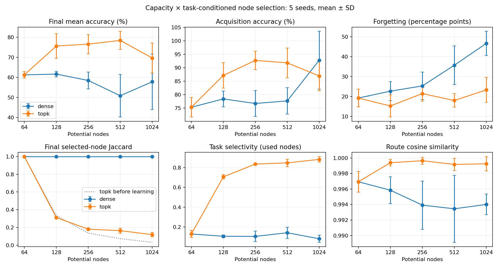

# 第七轮：容量与分区的配对筛查

完成5规模×2模式×5种子=50条连续流、200任务阶段；每阶段30轮512样本，5步BPTT。表中准确率为两个输出全对，均值±样本标准差。

| 节点 | 模式 | 新任务刚学完% | 最终平均% | 遗忘百分点 | BWT百分点 |
|---|---|---|---|---|---|
| 64 | dense | 75.28 ± 3.65 | 61.25 ± 1.60 | 19.28 ± 4.47 | -18.71 ± 4.64 |
| 64 | topk | 75.28 ± 3.65 | 61.25 ± 1.60 | 19.28 ± 4.47 | -18.71 ± 4.64 |
| 128 | dense | 78.38 ± 2.97 | 61.64 ± 1.40 | 22.75 ± 4.71 | -22.32 ± 5.44 |
| 128 | topk | 87.13 ± 4.78 | 75.63 ± 6.19 | 15.34 ± 5.56 | -15.33 ± 5.57 |
| 256 | dense | 76.68 ± 4.84 | 58.46 ± 4.15 | 25.36 ± 6.92 | -24.30 ± 7.94 |
| 256 | topk | 92.72 ± 3.44 | 76.57 ± 4.80 | 21.54 ± 3.73 | -21.54 ± 3.73 |
| 512 | dense | 77.65 ± 4.93 | 50.85 ± 10.61 | 35.74 ± 9.66 | -35.74 ± 9.66 |
| 512 | topk | 91.82 ± 5.54 | 78.43 ± 4.53 | 18.06 ± 3.37 | -17.86 ± 3.62 |
| 1024 | dense | 92.80 ± 10.76 | 57.81 ± 13.77 | 46.65 ± 6.07 | -46.65 ± 6.07 |
| 1024 | topk | 86.91 ± 5.50 | 69.65 ± 7.51 | 23.37 ± 6.27 | -23.01 ± 6.80 |

## 分区指标

选择Jaccard指实际硬节点支持集；激活Jaccard指各任务平均绝对激活前25%且大于1e-8的节点，剔除零激活，二者不同。SI只在至少一个任务上有非微小激活的节点统计，避免未使用节点随N增加机械稀释。路由相似度只比较结构存在的块边。所有任务采用相同输入数值和规则采样。

| N | 模式 | 选择重叠初始→最终 | 激活重叠最终 | SI初始→最终 | 路由余弦最终 |
|---|---|---|---|---|---|
| 64 | dense | 1.000 → 1.000 | 0.775 | 0.043 → 0.129 | 0.997 |
| 64 | topk | 1.000 → 1.000 | 0.775 | 0.043 → 0.129 | 0.997 |
| 128 | dense | 1.000 → 1.000 | 0.863 | 0.028 → 0.107 | 0.996 |
| 128 | topk | 0.334 → 0.311 | 0.279 | 0.627 → 0.707 | 0.999 |
| 256 | dense | 1.000 → 1.000 | 0.939 | 0.046 → 0.105 | 0.994 |
| 256 | topk | 0.136 → 0.180 | 0.180 | 0.857 → 0.836 | 1.000 |
| 512 | dense | 1.000 → 1.000 | 0.905 | 0.045 → 0.142 | 0.993 |
| 512 | topk | 0.073 → 0.163 | 0.163 | 0.926 → 0.848 | 0.999 |
| 1024 | dense | 1.000 → 1.000 | 0.807 | 0.046 → 0.081 | 0.994 |
| 1024 | topk | 0.032 → 0.118 | 0.118 | 0.967 → 0.884 | 0.999 |

## 能与不能推断的内容

- 低选择重叠可能是随机Top-K初始化和任务私有选择表带来的，必须看初始→最终变化。低重叠或高选择性本身不等于有用的功能分工，更不证明出现复杂智能。
- 四个来源/目的角色仍是人工设置；本轮只考察每个角色内部的任务选择，非自发发现整个模块结构。任务身份从t0明确可见，两组相同；R仍到t4才给。
- 每步Top-K仅64节点允许非零，但仍执行稠密运算；不构成等FLOPs或真实稀疏加速证据。topk采用活动方差归一，选择器含额外任务专属参数，不能把所有差异归于容量或稀疏性。
- 各规模同数据和更新次数，非等总计算；只有一个任务顺序、固定超参数与有限预算。未充分学会任务的组不能用于证明容量够/不够，也不能用小遗忘宣称优势。
- 不同于第六轮：从头学习A、任务身份更早、预算更小、5步截断。因此不直接跨轮比较分数。扩大规模时保持任务固定用于隔离规模，复杂任务是之后独立研究。

## 验证

50个最终检查点重载，200个最终任务分复算一致；Top-K非零状态最多64；固定B/mask一致；N64两模式的所有阶段成绩逐种子完全一致。中间阶段只保存分数与训练曲线，不声称重载了未保存的中间模型。所有失败和随机种子均保留。

## 64节点混合任务正对照

同样总更新480次，四任务交替训练：最终平均 70.60 ± 4.33%。5个检查点20个分数复算一致。该组可持续访问所有任务训练集，不是无回放或小记忆持续学习。若未接近满分，只能说明这个预算未充分学会，不能由此宣布容量不足。
## 本轮结论

1. 单纯扩大dense底网没有解决遗忘：64节点最终61.25%，1024节点57.81%；但1024节点刚学完平均92.80%，高于其最终成绩，说明“能获取新任务”和“能保留旧任务”仍不同。这里“更高”是描述性均值比较，不是统计显著性检验。
2. 固定逻辑活动64节点时，Top-K组从64节点61.25%到512节点78.43%，但1024节点回落到69.65%。支持当前预算下候选容量配合显式选择机制有用，不支持单调扩大必然变强，也不能宣布512是普遍最优规模。
3. 没有观察到训练让大网任务支持集越来越独立：512节点选择重叠0.073→0.163，1024节点0.032→0.118，均增加；对应选择性也低于初始化。随机初始化和任务专属选择表已提供了分区，不能将其全部归于学习涌现。
4. 块级平均路由余弦接近1，不足以推出每步路径相同：它平均了时间和两种规则，且没有把任务节点选择掩码融合进路径相似度。实际支持集仍不同。后续应比较逐规则、逐时间的有效边使用，不能仅靠平均gate热图下结论。
5. 小网混合训练70.60%未达到充分拟合，因此本轮不能严格排除容量不足或优化不足。下一步最有针对性的对照是固定随机Top-K与可学习Top-K配对、再统一节点数做回放和控制器/读出保护，避免同时增加机制后难以归因。

本轮没有执行真实稀疏算子、复杂任务链或无任务身份的自发分区。中断后缺失8条1024节点流已续跑，记录见RESUME.md。

